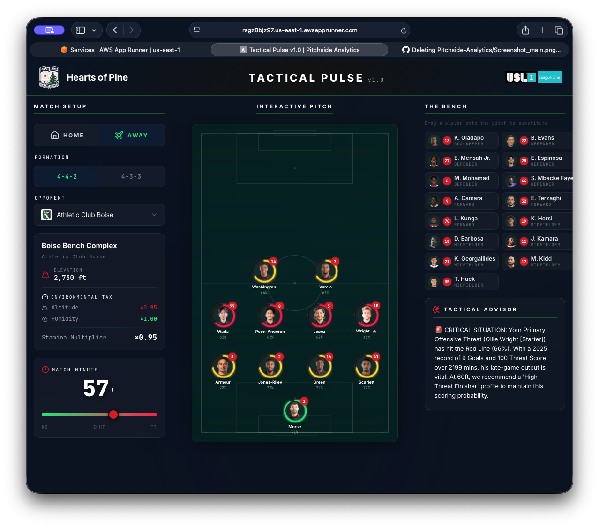

# ⚽ Tactical Pulse v1.0: Portland Hearts of Pine Performance Engine

**Tactical Pulse** is a high-fidelity soccer analytics dashboard designed to bridge the gap between raw historical data and real-time match strategy. Built as a capstone project for the AI and Data Analytics Master's program, this application serves as a "Digital Temple" for team performance, specifically tailored for the **Portland Hearts of Pine**.

---

## 🎯 The Problem & The Solution
In professional soccer, "gut feeling" often dictates late-game substitutions. **Tactical Pulse** replaces intuition with data. By fusing **2025 Master Stats** with real-time match variables (minutes played, stamina decay, and altitude), the engine identifies the "Pine Line"—the critical threshold where a starter’s effectiveness drops.

## 🚀 Key Features

### 1. The "Iron Eleven" Starter Logic
The dashboard automatically populates the 4-4-2 formation using **Minutes Played** from the 2025 season. This ensures that the most durable and consistent "Iron Men" are treated as the default starters.

### 2. Tactical Advisor (Powered by Gemini)
A bespoke AI engine that acknowledges the historical context of every player.
* **Goal Recognition:** Specifically tracks top scorers like **Masashi Wada** and **Ollie Wright** (9 goals each).
* **Profile-Based Subs:** Suggests substitutions based on position and performance profile to avoid on-field conflicts.

### 3. Match Dynamics Simulator
* **Stamina Decay:** Real-time calculation of fatigue.
* **Visual Priority:** Uses a high-contrast **Portland Navy, Crimson, and Forest Green** UI designed for AAA accessibility standards.

---
### 🕒 Dashboard Visual

---

## 🛠️ Technical Stack
* **Frontend:** Next.js, React, Framer Motion
* **Backend:** Node.js API Route Handlers (Server-side key protection)
* **AI Engine:** Google Gemini (Generative Tactical Insights)
* **Deployment:** AWS App Runner (Production CI/CD)

---

## 🧑‍💻 The Journey: From Coder to Architect
This project represents a professional transformation. Over the course of six workshops, I evolved from analyzing static datasets to orchestrating multiple AI agents in a high-stakes development environment. As an **AI Architect**, I leveraged tools like **Antigravity** to oversee a complex data pipeline, ensuring the final product reflects integrity and stewardship.

---

## 📄 License
Developed by **Alfred Burgess** | 2026 AI Development Capstone.
